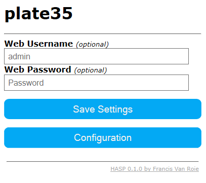

### Setup HTTP User Athentication

To restrict access to the web user interface you can set a Username and Password.

Click 'Save Settings' to activate.

* Please note that all http communication is unencrypted and that this is only a simple security measure